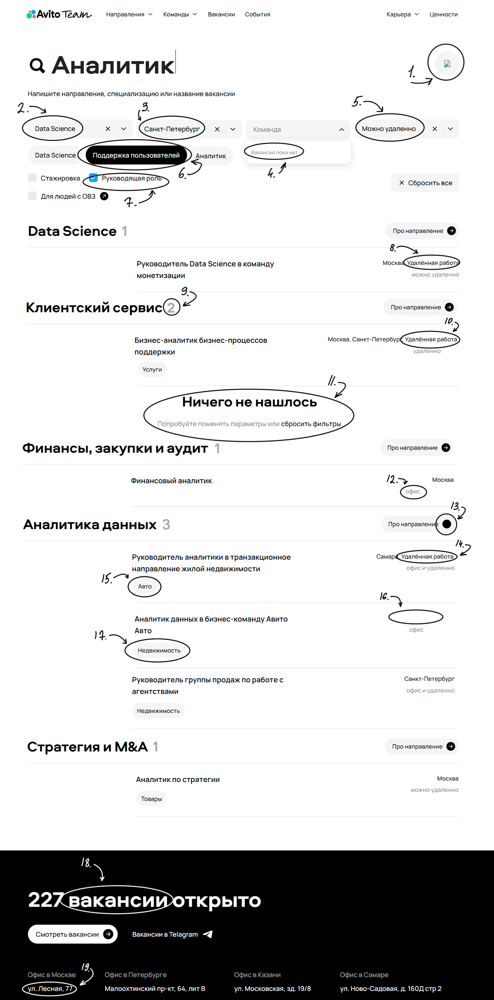

# Баг-репорты

## Описание

В этом файле документируются баги, обнаруженные в процессе тестирования 
---

---

## Задание 1: Баги карьерного сайта Авито

**ID бага**: 1  
**Описание**: Не подгрузилась картинка иконки  
**Приоритет**: Low

---

**ID бага**: 2  
**Описание**: Фильтр направления не работает  
**Приоритет**: High

---

**ID бага**: 3  
**Описание**: Фильтр по городу не работает  
**Приоритет**: High

---

**ID бага**: 4  
**Описание**: Фильтр по командам не имеет значений в выпадающем списке хотя они есть  
**Приоритет**: High

---

**ID бага**: 5  
**Описание**: Фильтр по формату работы не работает  
**Приоритет**: High

---

**ID бага**: 6
**Описание**: Дополнительный фильтр по направлениям не работает  
**Приоритет**: High

---

**ID бага**: 7  
**Описание**: Фильтр по руководящей должности не работает  
**Приоритет**: Medium  

---

**ID бага**: 8  
**Описание**: Не нужная дополнительная информация в текстовом поле города  
**Приоритет**: Low  

---

**ID бага**: 9  
**Описание**: Не корректное отображение количества вакансий в блоке Клиентский сервис  
**Приоритет**: Medium  

---

**ID бага**: 11
**Описание**: Отображается блок "Ничего не нашлось" но результат есть  
**Приоритет**: High  

---

**ID бага**: 12  
**Описание**: Не верное форматирование блока формата работы в вакансии  
**Приоритет**: Medium

---

**ID бага**: 13  
**Описание**: Нет стрелочки на кнопке "Про направление" на остальных присутствует  
**Приоритет**: Low  

---

**ID бага**: 15
**Описание**: Не правильное отображение команды в вакансии (перепутано)  
**Приоритет**: Medium

---

**ID бага**: 16  
**Описание**: Нет города в вакансии  
**Приоритет**: Medium

---

**ID бага**: 18 
**Описание**: Орфографическая ошибка в тексте  
**Приоритет**: Low  

---

**ID бага**: 19  
**Описание**: Не верный номер дома в адресе в блоке контакты  
**Приоритет**: Medium

---
